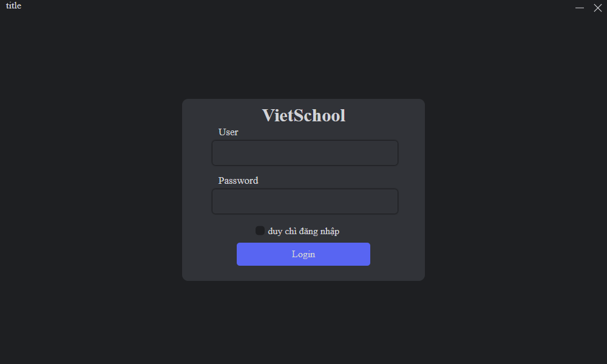
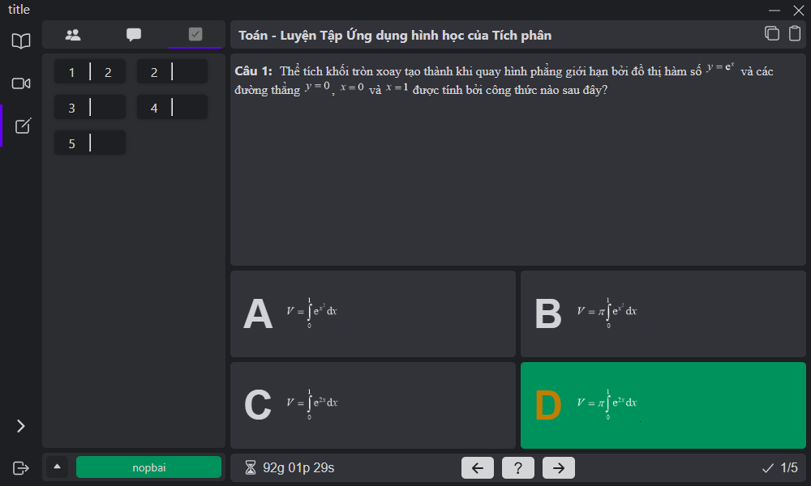
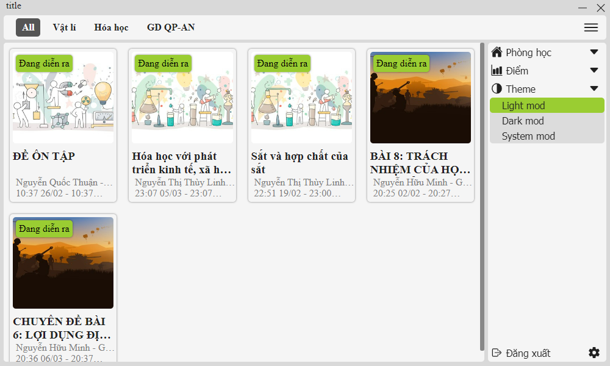
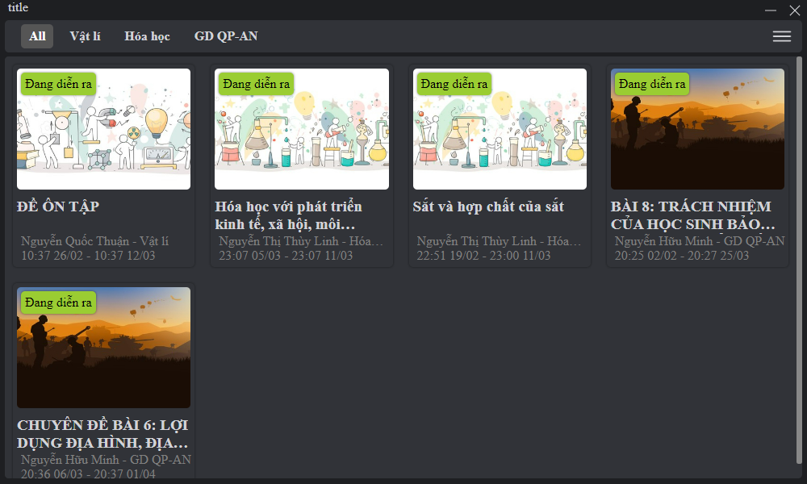
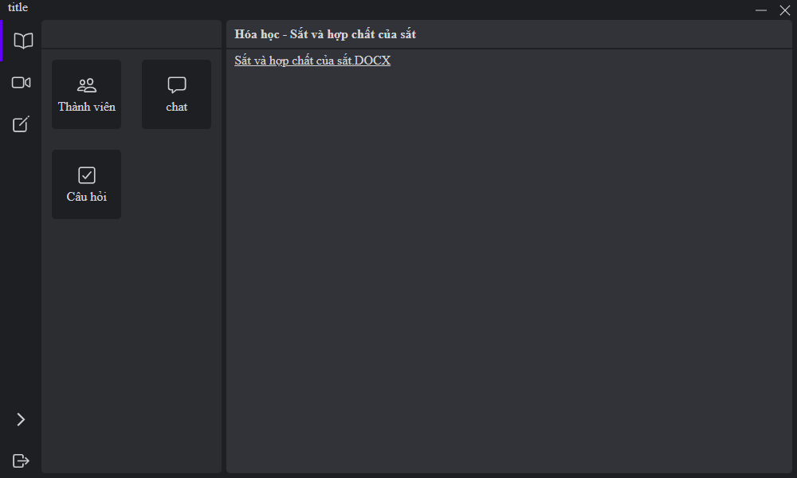
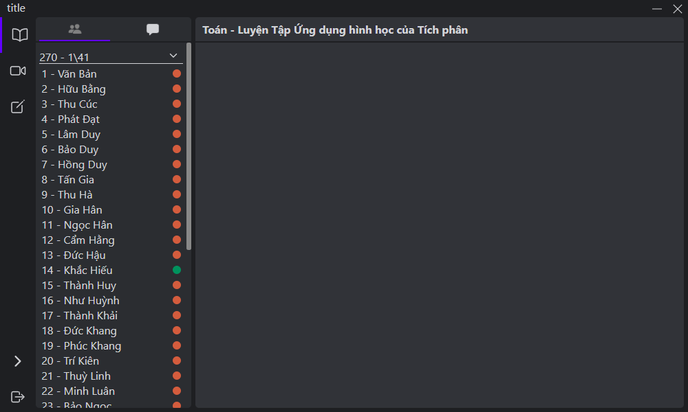

# Lop-hoc

ứng dụng được làm anh diên cho học sinh, nhằm tăng trải nhiệm học sinh khi sử dụng web lớp học với một số sinh năng hay ho bổ sung;

* tự động điểm danh
* chế độ ẩn danh
* vào xem trước đề bài mà không cần điểm danh
* xuất được bài tập trăc nhiệm dới dạn file
* gia diện đơn giả

---

Screenshot

